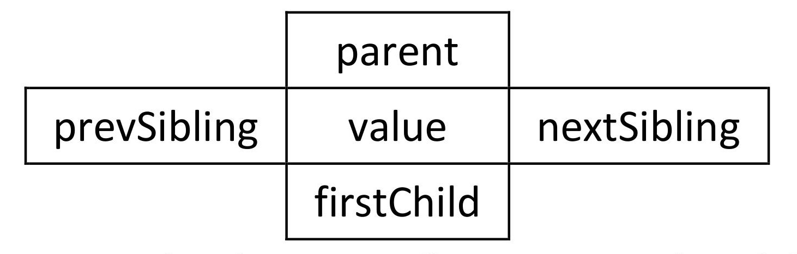
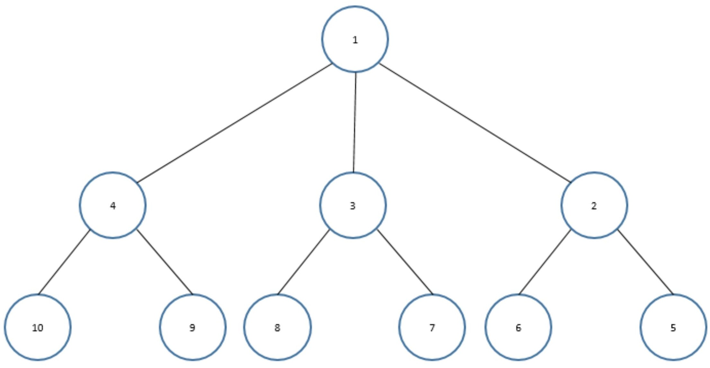
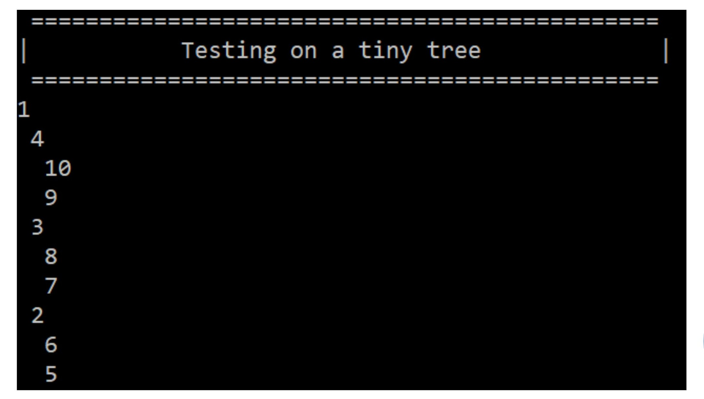
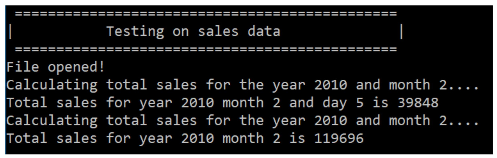
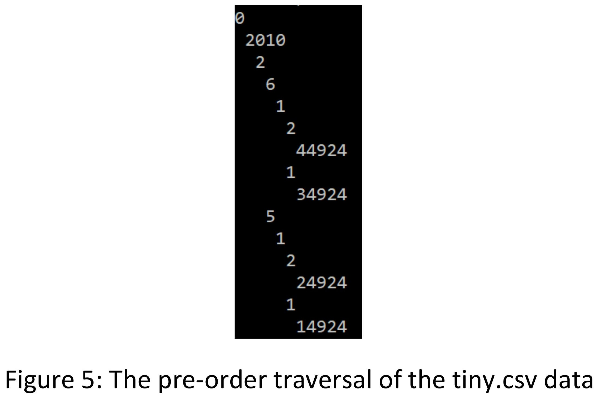
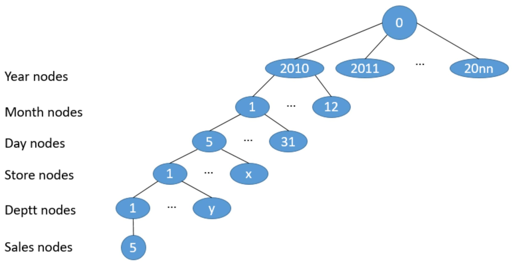

# Tree-Implementation-in-C-plus-plus

Trees are an important data structure used in various applications. This repository first implements (general) trees in C++. Then, uses the tree data structure to load a dataset of weekly sales by various departments in multiple stores owned by a single retail store chain and then uses this tree to answer interesting queries on that data.

# Description of individual classes and/or files

# Class TreeNode
This class defines a node in the tree data structure. It is templatized to be generic. It includes pointers to
other TreeNode objects, specifically, a parent pointer, a pointer to the first child, a pointer to the next
sibling and a pointer to the previous sibling.

     

An explanation of what each member function of this class is supposed to do, follows. The implementation
of these functions is provided in the file node_impl.h:

# TreeNode<T>()
This is the default constructor. It should assign a default value to all object members.

# TreeNode<T>(T val) 
This is a parameterized constructor. The value in variable val should be copied to the value member of the object, while all pointers should be assigned a default value.
    
# bool IsRoot() 
This function should return true if the current object is the root node of the tree, otherwise return false.

# bool IsExternal() 
This function should return true if the current object is an external node of the tree, otherwise return false.

# int GetHeight()
This function should return the height of the node in the tree.

# int GetDepth()
This function should return the depth of the node in the tree.

# T GetValue() 
This function should return the value stored at the current node.

# void SetValue (T val) 
This function should update the value stored at the current node based on what is passed as argument.

# bool AddChild(T val)
Create a new node object and add it as a child of the current node. For efficiency, the new node should be added as the first child of the current node. If a first child already exists, it should now become the second child. If a child node already has the value in variable val, this function should not modify the tree and return false. Return true if the child is successfully added.

# void DeleteChild(T val) 
Delete the child that stores the same value as in the variable val, if any.

# TreeNode<T>* SearchChild(T val) 
Search for a child node (NOTE: one level lower only) of this object that stores the value in variable val. Return that child node’s address. Return NULL if no child node of the current node stores this value.

# TreeNode<T>* GetParent()
Return the address of the parent node of the current node.

# TreeNode<T>* GetNextSibling() 
Return the address of this node’s next sibling.

# TreeNode<T>* GetPrevSibling()
Return the address of this node’s previous sibling.

# TreeNode<T>* GetFirstChild()
Return the address of the first child of the current node.

# Class Tree
This class implements the tree data structure using the class TreeNode. This class maintains a pointer to
the root node of the tree as the primary means of accessing the nodes in the tree. A secondary means of
accessing the tree is the member called cursor. This is a pointer, which should initially be the same as root
and can be moved around over the nodes of the tree using the functions MoveUp(), MoveDown(),
MoveLeft(), MoveRight() and ResetCursor(). Certain member functions of the tree class operate on the
node pointed to by cursor.

     

A brief description of what each function in the class Tree is expected to do follows:

# Tree() 
The default constructor. It should create an empty tree. The size member variable should be appropriately assigned.

# ~Tree()
This is the destructor for the tree. This task must be done recursively. For re-use, simply call the Destroy() function from the destructor.

# void Deallocate(TreeNode<T>* p)
Deallocate the subtree rooted at node p. This must be done recursively. Apply the appropriate traversal block to free the memory allocated to each node in the subtree rooted at p.
    
# TreeNode<T>* Root() 
Returns a pointer to the root node of the tree.

# bool IsEmpty()
Return true if the tree is empty, false otherwise.

# int Size()
Returns the number of nodes in the tree. This can simply return the value of the size member variable, if you maintain that variable on every add / delete to the tree.

# void PreOrder()
This is the top level function called to do a pre-order traversal of the tree. This function should call the overloaded PreOrder() function with the root node as the first argument and 0 for the second. That function implements the pre-order semantics recursively.

# void PostOrder() 
This is the top level function called to do a post-order traversal of the tree. This function should call the overloaded PostOrder() function with the root node as the first argument and 0 as the second. That function implements the post-order semantics recursively.

# void PreOrder(TreeNode<T>* n, int depth)
This function should do a pre-order traversal of the subtree rooted at the node n. The visit operation is to display the value stored at the node preceded by as many spaces as the value stored in the variable depth. This function must be implemented recursively.
    
# void PostOrder(TreeNode<T>* n, int depth)
This function should do a post-order traversal of the subtree rooted at the node n. The visit operation is to display the value stored at the node preceded by as many spaces as the value stored in the variable depth. This function must be implemented recursively.

# TreeNode<T>* Search(T val)
Searches the entire tree for and returns the pointer to the first node storing the same value as that passed in as argument to this function. If no such node exists, the function should return NULL. The search should be done on the tree nodes in the same order as a pre-order traversal. This function should simply call the function SearchBelow() with root node as the first argument.
    
# TreeNode<T>* SearchBelow(TreeNode<T>* n, T val)
Searches the subtree rooted at node n for and returns the pointer to the first node storing the same value as that passed in as argument to this function. If no such node exists, the function should return NULL. The search should be done on the tree
nodes in the same order as a pre-order traversal.
    
# TreeNode<T>* SearchChildren(TreeNode<T>*n, T val)
Searches the immediate children (only one level deep) of the node n for a node that stores the value passed in as second argument. If such a child exists, its address is returned. NULL is returned otherwise.
    
# TreeNode<T>* SearchChildren(T val) 
Searches the immediate children (only one level deep) of the node pointed to by the member variable cursor, for a node that stores the value passed in as second argument. If such a child exists, its address is returned. NULL is returned otherwise.

# TreeNode<T>* InsertChild(TreeNode<T>* parent, T val) 
Insert a new child under the node parent. The new node should store the value passed in as the second argument to this function. Return the address of the new node. This function should rely on the add child functionality of the TreeNode class.

# TreeNode<T>* InsertChild(T val)
Insert a new child under the node pointed to by the member variable cursor. The new node should store the value passed in as the second argument to this function. Return the address of the new node. This function should rely on the add child functionality of the TreeNode class.

# void Delete(TreeNode<T>* n, T val) 
Delete the subtree rooted at node n. Simply call the Deallocate() member function for this.

# void Destroy()
Deallocate the entire tree. Call the Deallocate member function() with the root node as parameter to do this.

# void InsertRootNode(T val) 
If the root node doesn’t already exist, insert a new node at the root of the tree, storing value passed in as argument to this function. Otherwise, do nothing.

# bool MoveDown() 
Move the cursor to the first child of the node pointed to by the member variable cursor and return true. If the node pointed to by cursor has no children, the cursor should not be updated and the function should return false.

# bool MoveRight()
Move the cursor to the next sibling of the node pointed to by the member variable cursor and the function should return true. If the node pointed to by cursor has no next sibling, the cursor should not be updated and the function should return false.

# bool MoveUp()
Move the cursor to the parent of the node pointed to by the member variable cursor and return true. If the node pointed to by cursor has no parent, the cursor should not be updated and the function should return false.

# bool MoveLeft()
Move the cursor to the previous sibling of the node pointed to by the member variable cursor and the function should return true. If the node pointed to by cursor has no previous sibling, the cursor should not be updated and the function should return false.

# TreeNode<T>* GetNode()
Return the value of the member variable cursor.

# void ResetCursor()
Reset the cursor member variable so that it points to the root node of the tree.

# The main() function
The main() function is defined in the file test.cpp. It simply calls two test functions, namely test_tiny_tree()
and test_tiny_sales().

# The test_tiny_tree() function
This function is defined in the file test.cpp. In the first three lines, it displays a banner on the screen to
show the user what is about to be done. It then creates a tree object to store unsigned int values. It
declares three TreeNode pointer variables. The value 1 is then inserted into the empty tree as the root
node. The values 2, 3 and 4 are then inserted, respectively into the tree with the root node as the parent,
and the pointers to the newly inserted children are stored in pointers p1, p2 and p3, respectively. Then,
the values 5 and 6 are inserted as children of the node storing value 2. The values 7 and 8 are inserted as
children of the node storing the value 3. The values 9 and 10 are inserted as children of the node storing
the value 4. The function then calls the PreOrder() function of the tree class to display the pre-order
traversal of the tree.

     

# The test_tiny_sales() function
This function first displays a banner on the screen to inform the user what is about to happen. It then
creates a tree object. It passes this tree object along with the filename “tiny.csv” to a function ReadFile().
This function is implemented in the file helper.h. The ReadFile() function reads the data
file tiny.csv and loads its contents into a tree as described below. The ReadFile() function returns true if
the file is successfully loaded into the tree. If not, it returns false. If the file is loaded, test_tiny_sales()
function proceeds to call two functions TotalDaySales() and TotalMonthSales() to calculate the total sales
for 5/2/2010 and the month of February, 2010, respectively. The test_tiny_sales() function displays the values returned by these functions and terminates.

     

We have come to possess leaked sales data for a large retail store chain. The file tiny.csv contains a subset
of that data. The file’s contents are:

Store,Dept,Date,Weekly_Sales,IsHoliday

1,1,2010-02-05,14924.5,FALSE

1,2,2010-02-05,24924.5,FALSE

1,1,2010-02-06,34924.5,FALSE

1,2,2010-02-06,44924.5,FALSE

The first column contains the attribute sotre ID, the second column stores the attribute department ID,
the third column contains the date in YYYY-MM-DD format. The fourth column stores the sales (US $)
made in the week identified by the date specified in the previous column by the store and department
identified in the first two columns, respectively. The last column is being ignored.

In the function ReadFile(), we create a root node in the tree with a value 0. This node is pretty much
useless, except it pulls all the data together. The children of the root node are all year values encountered
in the data file. In this case, there will be only one, storing the value 2010. In a different data file, however,
multiple year values may be present, and the root node would, correspondingly, have multiple children.

     

The function adds month nodes for every month, encountered in the Date column, under the
corresponding year node. In the case of tiny.csv, 2010 has only one child with value 2. The function also
adds day nodes for every distinct day of the month, encountered in the date column, under the
corresponding month node. In the case of tiny.csv, the node 2 has two children, namely 5 and 6. The store
IDs become the children of the day nodes and the department IDs become the children of the
corresponding store nodes. The actual sales amount for the specific week is inserted as a child of the
department node. The sales node is the leaf node.

     

# The TotalDaySales() function
This function should do some basic sanity checking to make sure that nodes for the year, month and day
passed in as argument exist in the tree object, also passed in as argument. It should locate the day object
node in the tree and pass a pointer to that object to the RecurseTotalDaySales() function. The value
returned in that call should be returned by TotalDaySales() function.

# The RecurseTotalDaySales() function
This function should calculate and return the total sales in the subtree rooted at the node whose pointer
is passed as argument.

# The TotalMonthSales() function
This function should do some basic sanity checking to make sure that nodes for the year and month passed
in as argument exist in the tree object, also passed in as argument. It should locate the month object node
in the tree and pass a pointer to that object to the RecurseTotalMonthSales() function. The value returned
in that call should be returned by TotalMonthSales() function.

# The RecurseTotalMonthSales() function
This function should calculate and return the total sales in the subtree rooted at the node whose pointer
is passed as argument.
